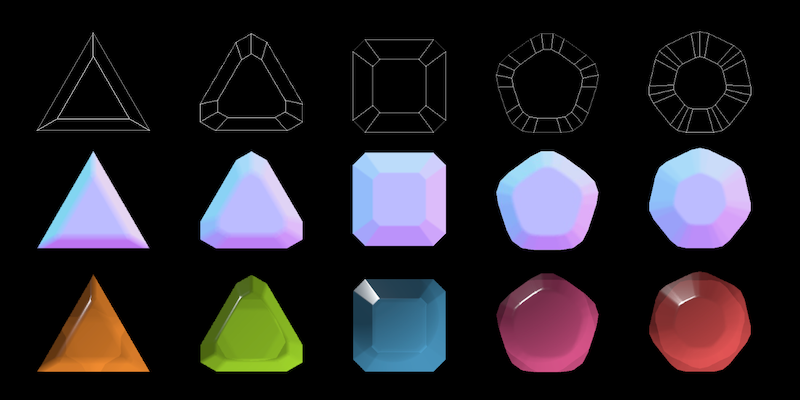

# Unity Gem Creator

---

Unity Gem Creator 是一个在 Unity 中创建宝石素材的工具。
* 通过参数化的方式控制宝石的形状、倒角、边距等，建立宝石网格模型
* 根据宝石形状生成法线贴图、并且可以控制面与面之间的平滑过渡
* 提供一个专用的宝石材质 2D Sprite 中渲染真实感宝石，包括颜色、散射、折射、高光等参数

这个工具的目标是提供一个简单，高效的方式来在游戏中创建和渲染2D游戏中的宝石元素。

